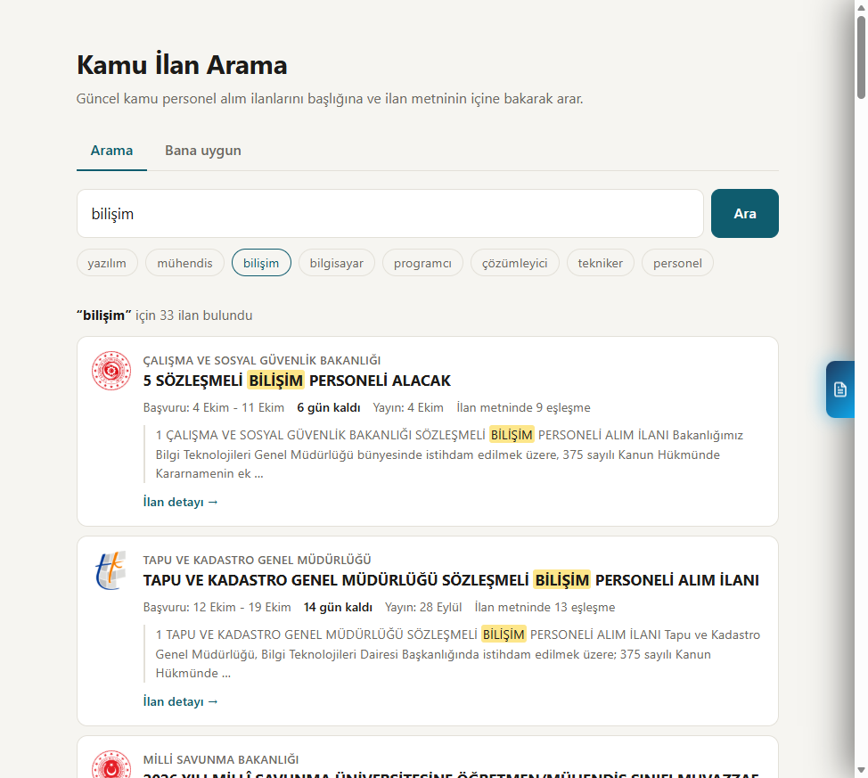

# Kamu İlan Botu

Güncel kamu personel alım ilanlarını kendi bilgisayarınızda arayabileceğiniz küçük bir site. İlanları [kamuilan.sbb.gov.tr](https://kamuilan.sbb.gov.tr/) adresinden alır, her ilanın PDF'ini okur ve yalnızca başlıkta değil **ilan metninin içinde** de arama yapar.



## Ne yapar?

- **Arama:** "bilişim" yazarsınız, başlığında ya da metninde bilişim geçen ilanlar gelir. Örneğin başlığı yalnızca "15 sözleşmeli personel alacak" olan bir ilanın içindeki bilişim kadrosunu da bulur. Türkçe harf ve büyük/küçük harf fark etmez ("bilisim" de olur).
- **Bana uygun:** Mesleğinizi ya da bölümünüzü, KPSS ve YDS puanınızı, SGK prim gününüzü sayfadaki forma girersiniz; site ilan metinlerindeki şartlarla karşılaştırıp ilanları "uygun görünüyor", "kontrol edilmeli", "bir şartı tutmuyor" ve "akademik kadro" diye ayırır. Her ilanda nedenini satır satır gösterir.
- **İlan detayı:** Kurum, başvuru tarihleri, kalan gün ve ilanın resmi PDF'i tek sayfada.
- **Bildirim botu (isteğe bağlı):** Belirlediğiniz kelimeleri içeren yeni ilanları günde iki kez kontrol eder, isterseniz Telegram'dan haber verir.

## Kurulum

Python 3.9 veya üstü gerekir.

```
git clone https://github.com/EmreKendirli/kamuilan.git
cd kamuilan
pip install -r requirements.txt
python app.py
```

Site `http://localhost:5000` adresinde açılır. Windows'ta `baslat.bat` dosyasına çift tıklamak da yeterlidir.

İlk açılışta bütün ilanların PDF'i indirilip metne çevrilir; bu birkaç dakika sürer ve ilerleme sayfada görünür. Sonraki açılışlarda yalnızca yeni ilanlar indirilir.

> Sayfayı `python app.py` ile açın. `templates/index.html` dosyasını tarayıcıda doğrudan ya da VS Code Live Server ile açarsanız arama çalışmaz.

## Kendi bilgilerinizi girme

"Bana uygun" sekmesindeki formu doldurup **İlanları getir**'e basın: meslek ya da bölüm, isterseniz yakın bölümler, KPSS ve YDS puanı, SGK prim günü. Boş bıraktığınız puan karşılaştırılmaz, ilandaki şart yalnızca bilgi olarak gösterilir. Girdikleriniz yalnızca kendi tarayıcınızda saklanır.

Formun hazır dolu gelmesini isterseniz proje klasöründe `profil.json` adında bir dosya oluşturun:

```json
{
    "title": "Yazılım Mühendisi",
    "departments": ["Yazılım Mühendisliği"],
    "related_departments": ["Bilgisayar Mühendisliği"],
    "kpss": 80,
    "yds": 60,
    "premium_days": 720
}
```

| Alan | Anlamı |
|---|---|
| `title` | Sekmede görünen unvan |
| `departments` | Mezun olduğunuz bölüm(ler); ilan metninde bu ad aranır |
| `related_departments` | Yakın bölümler. Yalnızca bunlar geçiyorsa ilan "kontrol edilmeli" grubuna düşer |
| `kpss` | KPSS puanınız |
| `yds` | Yabancı dil puanınız (yoksa 0) |
| `premium_days` | SGK prim gününüz (360 gün = 1 yıl deneyim) |

`profil.json` git'e eklenmez. Dosya yoksa form boş açılır. Değişiklikten sonra siteyi yeniden başlatın.

## Sunucuda çalıştırma

Depoda [Render](https://render.com) için hazır ayar var (`render.yaml`). Aşağıdaki düğme depoyu kendi Render hesabınıza kurar:

[](https://render.com/deploy?repo=https://github.com/EmreKendirli/kamuilan)

Render'ın ücretsiz planında site 15 dakika kullanılmayınca uyur; uyanınca ilanları baştan tarar.

Başka bir sunucuda aynı başlatma komutunu kullanabilirsiniz:

```
gunicorn app:app --workers 1 --threads 8 --bind 0.0.0.0:$PORT --timeout 120
```

İlan listesi ve metinler bellekte tutulduğu için `--workers 1` şarttır. Kalıcı disk bağlı değilse her yeniden başlatmada ilanlar baştan taranır (birkaç dakika). Kaynak site sunucunuzun bulunduğu ülkeden gelen istekleri engelliyorsa sayfada "Kaynak siteden ilanlar alınamadı" yazar.

## Ayarlar

Hepsi `config.py` içinde:

| Ayar | Ne işe yarar |
|---|---|
| `KEYWORDS` | Arama kutusunun altındaki öneriler ve bildirim botunun aradığı kelimeler |
| `SITE_PORT` | Sitenin çalıştığı port (varsayılan 5000) |
| `REFRESH_MINUTES` | İlan listesinin yenilenme sıklığı (varsayılan 30 dakika) |
| `CACHE_DIR` | İndirilen ilan dosyalarının tutulduğu klasör |
| `TELEGRAM_*` | Bildirim botunun Telegram ayarları |

## Bildirim botu

```
python main.py
```

Açılışta bir kez, sonra her gün 09:00 ve 15:00'te çalışır. Başlığında `KEYWORDS` listesindeki kelimelerden biri geçen yeni ilanları ekrana yazar ve `bulunan_ilanlar.json` dosyasına kaydeder. Telegram'dan da haber almak için `config.py` içinde `TELEGRAM_ENABLED = True` yapıp bot token'ınızı ve chat ID'nizi girin. Token'ı girdikten sonra `config.py` dosyasını herkese açık bir depoya göndermeyin.

Bildirimlerdeki linkler arama sitesinin detay sayfasına gider, bu yüzden yalnızca `app.py` çalışırken açılır.

## Dosyalar

| Dosya | Görevi |
|---|---|
| `app.py` | Site: arama, "Bana uygun" ve ilan detayı |
| `scraper.py` | İlan listesini ve ilan PDF'lerini kaynak siteden alır, metne çevirir |
| `matcher.py` | İlan metnindeki bölüm, KPSS, YDS ve deneyim şartlarını profille karşılaştırır |
| `main.py`, `notifier.py` | Bildirim botu |
| `templates/`, `static/` | Sayfalar ve stil |

## Sınırlar

- **"Bana uygun" bir ön elemedir.** Şartları ilan metninden kalıplarla (örn. "en az 3 yıl tecrübe", "KPSS en az 70 puan") çıkarır. Yaş sınırı, sertifika gibi şartlara bakmaz; tablo içinde yazan puanları okuyamayabilir; çok pozisyonlu ilanlarda bir şartın hangi pozisyona ait olduğunu her zaman ayıramaz. Başvurmadan önce ilanın kendisini okuyun.
- Taranmış (resim) PDF'lerin metni okunamaz; bu ilanlar yalnızca başlıklarıyla aranır.
- Tek kaynak kamuilan.sbb.gov.tr'dir. Orada yayımlanmayan ilanlar burada da çıkmaz.
- `python app.py` Flask'ın geliştirme sunucusunu başlatır; bu yalnızca kendi bilgisayarınız içindir. İnternete açarken "Sunucuda çalıştırma" bölümündeki komutu kullanın.

Bu proje resmi bir uygulama değildir ve Strateji ve Bütçe Başkanlığı ile bir bağlantısı yoktur.
